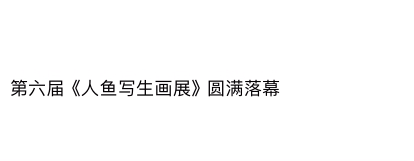
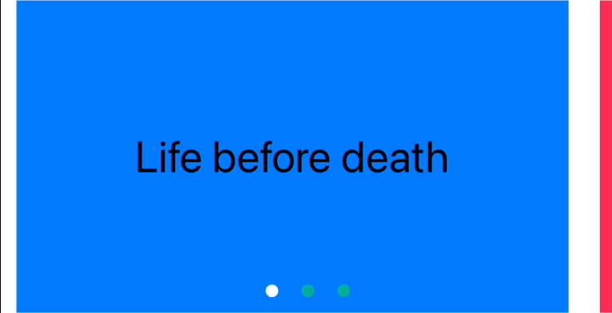

## CardCarousel

[](https://developer.apple.com/swift/)
[](https://www.apple.com/nl/ios/)
[](https://cocoapods.org/?q=CardCarousel)
[](https://swift.org/package-manager)
[](./LICENSE)

`CardCarousel` is a powerful yet easy-to-use carousel component that you can even configure with spells.


## Features

- [x] Supports method chaining

- [x] Supports setting page dimensions in a manner similar to `NSCollectionLayoutSize`

- [x] Supports multiple loop modes

- [x] Supports setting page alignment when scrolling stops

- [x] Supports setting scroll direction

- [x] Supports setting scroll animation effects for automatic scrolling

- [x] Supports setting page transition effects

- [x] Supports setting pagination threshold

- [x] Supports setting the deceleration rate of pages during sliding

- [x] Supports `SwiftUI`

- [x] Supports configuration through spells

- [x] And more...


## Installation

#### Swift Package Manager

In Xcode, select `File` > `Add Package Dependencies...`, paste `https://github.com/YuLeiFuYun/CardCarousel.git`

#### CocoaPods

```ruby
source 'https://github.com/CocoaPods/Specs.git'
platform :ios, '11.0'
use_frameworks!

target '<Your Target Name>' do
    pod 'CardCarousel'
end
```


## Requirements

- iOS 11+
- Xcode 15+


## Usage

#### In UIKit

- Simple use:

```swift
import CardCarousel

let cardCarousel = CardCarousel(frame: ...).move(to: view)

// After fetching data
cardCarousel.data = Array of web picture URLs as strings, or an array of UIImages.
```


- Custom cell:

```swift
CardCarousel(data: data) { (cell: CustomCell, index: Int, itemIdentifier: TestItem) in
    cell.imageView.kf.setImage(with: url)
    cell.indexLabel.backgroundColor = itemIdentifier.color
    cell.indexLabel.text = itemIdentifier.index
}
.cardLayoutSize(widthDimension: .fractionalWidth(0.7), heightDimension: .fractionalHeight(0.7))
.cardTransformMode(.liner(minimumAlpha: 0.3))
.cardCornerRadius(10)
.move(to: view, layoutConstraints: { cardCarouselView, superView in
    NSLayoutConstraint.activate([
        cardCarouselView.leadingAnchor.constraint(equalTo: superView.leadingAnchor),
        cardCarouselView.trailingAnchor.constraint(equalTo: superView.trailingAnchor),
        cardCarouselView.topAnchor.constraint(equalTo: superView.topAnchor, constant: 100),
        cardCarouselView.heightAnchor.constraint(equalToConstant: 200)
    ])
})
```


- SwiftUI View

```swift
CardCarousel(data: data) { index, itemIdentifier in
    HStack {
        Text(itemIdentifier)
            .font(.system(size: 18))
        Spacer()
    }
}
.scrollDirection(.topToBottom)
.move(to: view, layoutConstraints: { cardCarouselView, superView in
    NSLayoutConstraint.activate([
        cardCarouselView.leadingAnchor.constraint(equalTo: superView.leadingAnchor, constant: 10),
        cardCarouselView.trailingAnchor.constraint(equalTo: superView.trailingAnchor, constant: -10),
        cardCarouselView.topAnchor.constraint(equalTo: superView.topAnchor, constant: 100),
        cardCarouselView.heightAnchor.constraint(equalToConstant: 40)
    ])
})
```




- Custom page control

```swift
public protocol CardCarouselPageControlType: UIView {
    var numberOfPages: Int { get set }
    
    var currentPage: Int { get }
}

public protocol CardCarouselNormalPageControlType: CardCarouselPageControlType {
    var currentPage: Int { get set }
}

public protocol CardCarouselContinousPageControlType: CardCarouselPageControlType {
    var progress: Double { get set }
}

extension UIPageControl: CardCarouselNormalPageControlType { }
```

Example:

```swift
extension CHIPageControlAleppo: CardCarouselContinousPageControlType {
    ...
}

CardCarousel(dataPublisher: $data) { index, itemIdentifier in
    Text(itemIdentifier.text)
        .font(.title)
        .frame(maxWidth: .infinity, maxHeight: .infinity)
        .background(itemIdentifier.color)
}
.cardLayoutSize(widthDimension: .fractionalWidth(0.9), heightDimension: .absolute(200))
.minimumLineSpacing(20)
.scrollStopAlignment(.head(offset: 10))
.pageControl(makePageControl: {
    let pageControl = CHIPageControlAleppo()
    pageControl.currentPageTintColor = .white
    pageControl.tintColor = .green
    pageControl.radius = 4
    pageControl.padding = 15
    return pageControl
}, position: .centerXBottom(offset: CGPoint(x: 0, y: -10)))
.move(to: view) { cardCarouselView, superView in
    NSLayoutConstraint.activate([
        cardCarouselView.leadingAnchor.constraint(equalTo: superView.leadingAnchor),
        cardCarouselView.trailingAnchor.constraint(equalTo: superView.trailingAnchor),
        cardCarouselView.topAnchor.constraint(equalTo: superView.topAnchor, constant: 100),
        cardCarouselView.heightAnchor.constraint(equalToConstant: 200)
    ])
}
```




#### In SwiftUI

```swift
struct Content: View {
    @State var data = [
        "飞光飞光 劝尔一杯酒",
        "吾不识青天高 黄地厚",
        "惟见月寒日暖 来煎人寿",
        "食熊则肥 食蛙则瘦",
    ]
    
    
    var body: some View {
        CardCarouselView($data, content: { index, itemIdentifier in
            if index.isMultiple(of: 2) {
                ZStack {
                    Color.blue
                    Text(itemIdentifier)
                }
            } else {
                Text(itemIdentifier)
                    .frame(maxWidth: .infinity, maxHeight: .infinity)
                    .background(Color.yellow)
                    .clipShape(Capsule())
            }
        })
      	.scrollMode(.automatic(timeInterval: 3))
        .cardTransformMode(.coverflow(minimumAlpha: 0.3))
        .cardLayoutSize(widthDimension: .fractionalWidth(0.7), heightDimension: .fractionalHeight(0.7))
        .minimumLineSpacing(-20)
        .cardCornerRadius(10)
        // The larger the value, the further the slide after the user releases the drag, default is 0.9924.
        .decelerationRate(0.999)
        .onCardSelected({ index in
            print(index)
        })
        .onCardChanged({ index in
            print(index)
        })
        .frame(height: 200)
    }
}
```


#### 咒语

**高级动物**及**催妆曲**风格的咒语请以**全角逗号**分隔函数名、参数名与参数。多条咒语（即多个函数调用）以空格分割。

- 动物协鸣

```swift
CardCarousel(咒语: "汪咕呦汪叽嗡呜汪叽 喵呜 呜啾 嘎啾", 施法材料: data, 作用域: CGRect(x: 0, y: 100, width: 393, height: 200))
    .法术目标(view)

// 效果等同于
CardCarousel(frame: CGRect(x: 0, y: 100, width: 393, height: 200), data: data)
    .cardLayoutSize(widthDimension: .fractionalWidth(0.7), heightDimension: .fractionalHeight(0.7))
    .cardTransformMode(.liner)
    .scrollDirection(.rightToLeft)
    .loopMode(.rollback)
    .move(to: view)
```

- 高级动物

```swift
// 效果同上
CardCarousel(咒语: "矛盾，自私，好色，爱喜，无聊，善良，爱喜 贪婪，真诚 善变，暗淡 无奈，埋怨", 施法材料: data, 作用域: CGRect(x: 0, y: 100, width: 393, height: 200))
    .法术目标(view)
```

- 催妆曲

```swift
// 效果同上
CardCarousel(咒语: "醒呀，画眉在杏枝上歌，画眉人不起是因何，黛棕，远峰尖滴着新黛，正好蘸来描画双蛾，黛棕 晨鸡声呖呖在相催，日神也捧着金镜 画眉在杏枝上歌，她对着如镜的池塘 远峰尖滴着新黛，春莺儿衔了额黄归", 施法材料: data, 作用域: CGRect(x: 0, y: 100, width: 393, height: 200))
    .法术目标(view)
```

- 大威天龙

```swift
let 白素贞 = view
CardCarousel(咒语: "大威天龙", 施法材料: data)
    .法术目标(白素贞)

// 效果等同于
CardCarousel(data: data)
    .minimumLineSpacing(10)
    .pageControl(makePageControl: { UIPageControl() }, position: .centerXBottom)
    .move(to: view)
```


#### All Method

```swift
public protocol CardCarouselInterface {
    /// 卡片布局尺寸，默认铺满 super view
    ///
    /// 动物协鸣：汪；0-9：["汪", "啾", "喵", "咩", "哞", "呱", "嘎", "叽", "吱", "嘶"]
    /// widthDimension：咕；heightDimension：嗡
    /// fractionalWidth：呦；fractionalHeight：呜；absolute：嗷；inset：嘤
    ///
    /// 高级动物：矛盾；0-9：["爱", "贪", "嗔", "痴", "恨", "苦", "忧", "喜", "怨", "怒"]
    /// widthDimension：自私；heightDimension：无聊
    /// fractionalWidth：好色；fractionalHeight：善良；absolute：博爱；inset：诡辩
    ///
    /// 催妆曲：醒呀；0-9：["黛", "墨", "碧", "朱", "紫", "黄", "蓝", "棕", "灰", "白"]
    /// widthDimension：画眉在杏枝上歌；heightDimension：远峰尖滴着新黛
    /// fractionalWidth：画眉人不起是因何；fractionalHeight：正好蘸来描画双蛾；absolute：春莺儿衔了额黄归；inset：起呀
    func cardLayoutSize(widthDimension: CardLayoutDimension, heightDimension: CardLayoutDimension) -> Self
    
    /// 卡片最小间距，默认 0
    ///
    /// 动物协鸣：啾；0-9：["汪", "啾", "喵", "咩", "哞", "呱", "嘎", "叽", "吱", "嘶"]
    ///
    /// 高级动物：虚伪；0-9：["爱", "贪", "嗔", "痴", "恨", "苦", "忧", "喜", "怨", "怒"]
    ///
    /// 催妆曲：从睡乡醒回；0-9：["黛", "墨", "碧", "朱", "紫", "黄", "蓝", "棕", "灰", "白"]
    func minimumLineSpacing(_ spacing: CGFloat) -> Self
    
    /// 卡片变换模式，默认 .none
    ///
    /// 动物协鸣：喵；liner：呜；coverflow：嗷
    ///
    /// 高级动物：贪婪；liner：真诚；coverflow：金钱
    ///
    /// 催妆曲：晨鸡声呖呖在相催；liner：日神也捧着金镜；coverflow：等候你起来梳早妆
    func cardTransformMode(_ mode: CardTransformMode) -> Self
    
    /// 默认当前卡片始终在最前面，调用此方法，当前卡片可能会被其他卡片遮挡。
    ///
    /// 动物协鸣：咩
    ///
    /// 高级动物：欺骗
    ///
    /// 催妆曲：看呀
    func disableCurrentCardAlwaysOnTop() -> Self
    
    /// 滑动方向两侧的边距，loopMode 非 circular 时才会生效。默认 0
    ///
    /// 动物协鸣：哞；0-9：["汪", "啾", "喵", "咩", "哞", "呱", "嘎", "叽", "吱", "嘶"]
    ///
    /// 高级动物：幻想；0-9：["爱", "贪", "嗔", "痴", "恨", "苦", "忧", "喜", "怨", "怒"]
    ///
    /// 催妆曲：霞织的五彩衣裳；0-9：["黛", "墨", "碧", "朱", "紫", "黄", "蓝", "棕", "灰", "白"]
    func sideMargin(_ margin: CGFloat) -> Self
    
    /// 滑动停止时的卡片对齐方式，默认中心对齐
    ///
    /// 动物协鸣：呱；0-9：["汪", "啾", "喵", "咩", "哞", "呱", "嘎", "叽", "吱", "嘶"]
    /// center：咕；head：嗡
    ///
    /// 高级动物：疑惑；0-9：["爱", "贪", "嗔", "痴", "恨", "苦", "忧", "喜", "怨", "怒"]
    /// center：地狱；head：天堂
    ///
    /// 催妆曲：趁草际珠垂；0-9：["黛", "墨", "碧", "朱", "紫", "黄", "蓝", "棕", "灰", "白"]
    /// center：画眉在杏枝上歌；head：画眉人不起是因何
    func scrollStopAlignment(_ alignment: CardScrollStopAlignment) -> Self
    
    /// 单卡片时的对齐方式，默认中心对齐
    ///
    /// 动物协鸣：呦；0-9：["汪", "啾", "喵", "咩", "哞", "呱", "嘎", "叽", "吱", "嘶"]
    /// center：咕；head：嗡
    ///
    /// 高级动物：简单；0-9：["爱", "贪", "嗔", "痴", "恨", "苦", "忧", "喜", "怨", "怒"]
    /// center：地狱；head：天堂
    ///
    /// 催妆曲：春莺儿衔了额黄归；0-9：["黛", "墨", "碧", "朱", "紫", "黄", "蓝", "棕", "灰", "白"]
    /// center：画眉在杏枝上歌；head：画眉人不起是因何
    func singleCardAlignment(_ alignment: CardScrollStopAlignment) -> Self
    
    /// 滚动方向，默认 .leftToRight
    ///
    /// 动物协鸣：呜
    /// leftToRight：汪；rightToLeft：啾；topToBottom：喵；bottomToTop：咩
    ///
    /// 高级动物：善变
    /// leftToRight：辉煌；rightToLeft：暗淡；topToBottom：得意；bottomToTop：伤感
    ///
    /// 催妆曲：画眉在杏枝上歌
    /// leftToRight：杨柳的丝发飘扬；rightToLeft：她对着如镜的池塘；topToBottom：百花是薰沐已毕；bottomToTop：她们身上喷出芬芳
    func scrollDirection(_ direction: CardScrollDirection) -> Self
    
    /// 自动滚动时的滚动动画效果，默认 .system
    func autoScrollAnimation(_ animationOptions: CardScrollAnimationOptions) -> Self
    
    /// 自动滚动还是手动滚动，默认 .automatic(timeInterval: 3)
    ///
    /// 动物协鸣：嗡；0-9：["汪", "啾", "喵", "咩", "哞", "呱", "嘎", "叽", "吱", "嘶"]
    /// automatic：咕；manual：嗡
    ///
    /// 高级动物：好强；0-9：["爱", "贪", "嗔", "痴", "恨", "苦", "忧", "喜", "怨", "怒"]
    /// automatic：怀恨；manual：报复
    ///
    /// 催妆曲：画眉人不起是因何；0-9：["黛", "墨", "碧", "朱", "紫", "黄", "蓝", "棕", "灰", "白"]
    /// automatic：远峰尖滴着新黛；manual：正好蘸来描画双蛾
    ///
    /// 注意：用咒语调用时时间间隔只能设为整数！
    func scrollMode(_ mode: CardScrollMode) -> Self
    
    /// 循环模式，默认 circular
    ///
    /// 动物协鸣：嘎
    /// circular：汪；rollback：啾；single：喵
    ///
    /// 高级动物：无奈
    /// circular：争夺；rollback：埋怨；single：冒险
    ///
    /// 催妆曲：远峰尖滴着新黛
    /// circular：趁草际珠垂；rollback：春莺儿衔了额黄归；single：赶快拿妆梳理好
    func loopMode(_ mode: CardLoopMode) -> Self
    
    /// 卡片分页阈值，默认卡片宽度的一半
    ///
    /// 动物协鸣：叽；0-9：["汪", "啾", "喵", "咩", "哞", "呱", "嘎", "叽", "吱", "嘶"]
    /// fractional：咕；absolute：嗡
    ///
    /// 高级动物：孤独；0-9：["爱", "贪", "嗔", "痴", "恨", "苦", "忧", "喜", "怨", "怒"]
    /// fractional：伟大；absolute：渺小
    ///
    /// 催妆曲：正好蘸来描画双蛾；0-9：["黛", "墨", "碧", "朱", "紫", "黄", "蓝", "棕", "灰", "白"]
    /// fractional：画眉在杏枝上歌；absolute：画眉人不起是因何
    func pagingThreshold(_ pagingThreshold: CardPagingThreshold) -> Self
    
    /// 一个浮点值，用于确定用户抬起手指后的减速率，值越大抬起手之后滑得越远，loopMode 为 rollback 时设置无效，默认值为 0.9924
    ///
    /// 动物协鸣：吱；0-9：["汪", "啾", "喵", "咩", "哞", "呱", "嘎", "叽", "吱", "嘶"]
    ///
    /// 高级动物：脆弱；0-9：["爱", "贪", "嗔", "痴", "恨", "苦", "忧", "喜", "怨", "怒"]
    ///
    /// 催妆曲：杨柳的丝发飘扬；["黛", "墨", "碧", "朱", "紫", "黄", "蓝", "棕", "灰", "白"]
    func decelerationRate(_ value: CGFloat) -> Self
    
    /// 禁止用户滑动
    ///
    /// 动物协鸣：嘶
    ///
    /// 高级动物：忍让
    ///
    /// 催妆曲：她对着如镜的池塘
    func disableUserSwipe() -> Self
    
    /// 使用默认 cell 加载网络图片时，默认启用下采样，调用此方法禁用下采样
    ///
    /// 动物协鸣：咕
    ///
    /// 高级动物：气愤
    ///
    /// 催妆曲：百花是薰沐已毕
    func disableDownsampling() -> Self
    
    /// 设置 backgroundView
    func backgroundView(_ view: UIView) -> Self
    
    /// 卡片圆角设置
    ///
    /// 动物协鸣：嗷，不支持 maskedCorners 设置
    ///
    /// 高级动物：复杂，不支持 maskedCorners 设置
    ///
    /// 催妆曲：她们身上喷出芬芳，不支持 maskedCorners 设置
    func cardCornerRadius(_ value: CGFloat, maskedCorners: CACornerMask) -> Self
    
    /// 禁用反弹效果
    func disableBounce() -> Self
    
    /// 设置边框宽度及颜色
    func border(width: CGFloat, color: CGColor?) -> Self
    
    /// 设置使用默认卡片时的占位图
    func placeholder(_ image: UIImage) -> Self
    
    /// 阴影相关
    func shadow(offset: CGSize, color: CGColor?, radius: CGFloat, opacity: Float, path: CGPath?) -> Self
    
    /// 设置 page control
    func pageControl(makePageControl: @escaping () -> CardCarouselPageControlType, position: PageControlPosition) -> Self
    
    /// 卡片被点击时调用
    func onCardSelected(_ handler: @escaping (_ index: Int) -> Void) -> Self
    
    /// 卡片滚动时调用
    func onScroll(_ handler: @escaping (_ offset: CGPoint, _ progress: CGFloat) -> Void) -> Self
    
    /// 卡片切换时调用
    func onCardChanged(_ handler: @escaping (_ index: Int) -> Void) -> Self
    
    /// 开始拖动卡片时调用
    func onWillBeginDragging(_ handler: @escaping (_ index: Int) -> Void) -> Self
    
    /// 结束拖动卡片时调用
    func onWillEndDragging(_ handler: @escaping (_ index: Int) -> Void) -> Self
    
    /// 数据预取
    func onPrefetchItems(_ handler: @escaping (_ indexs: [IndexPath]) -> Void) -> Self
    
    /// 取消预取
    func onCancelPrefetchItems(_ handler: @escaping (_ indexs: [IndexPath]) -> Void) -> Self
}
```


## Acknowledgments

- [TYCyclePagerView](https://github.com/12207480/TYCyclePagerView)
- [scroll_animation](https://github.com/qyz777/scroll_animation)
- [Asynchronous operations for writing concurrent solutions in Swift](https://www.avanderlee.com/swift/asynchronous-operations/)


## License

`CardCarousel` is released under the MIT license. See LICENSE for details.
